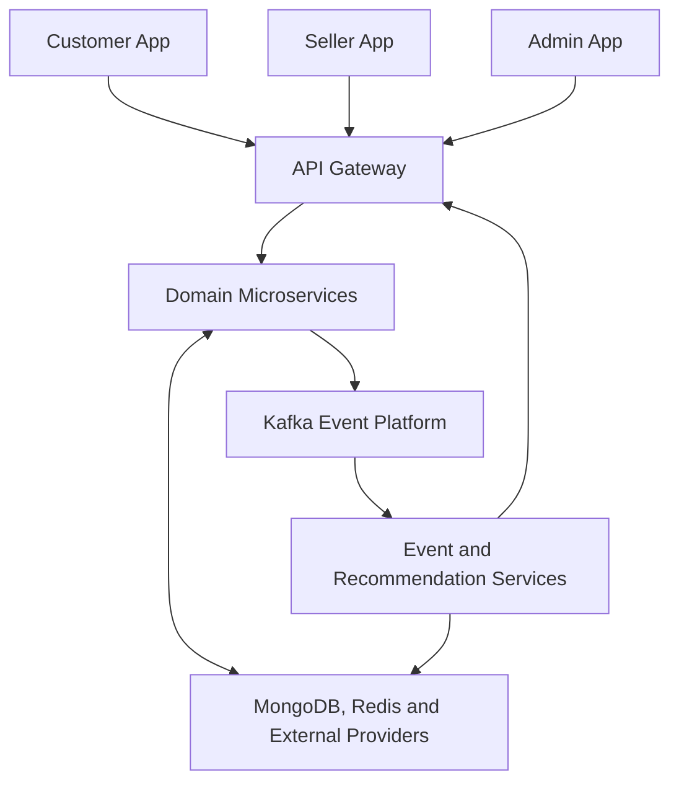
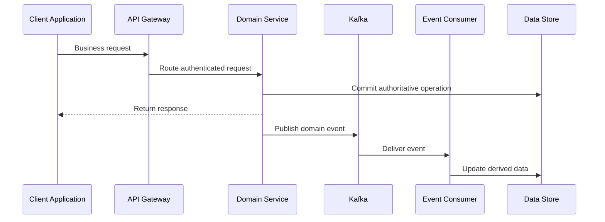
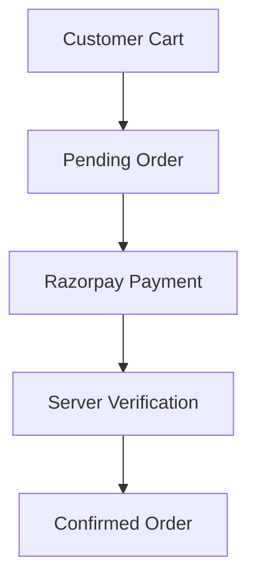
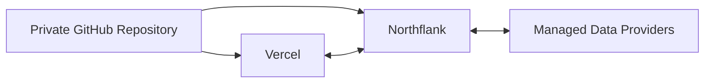
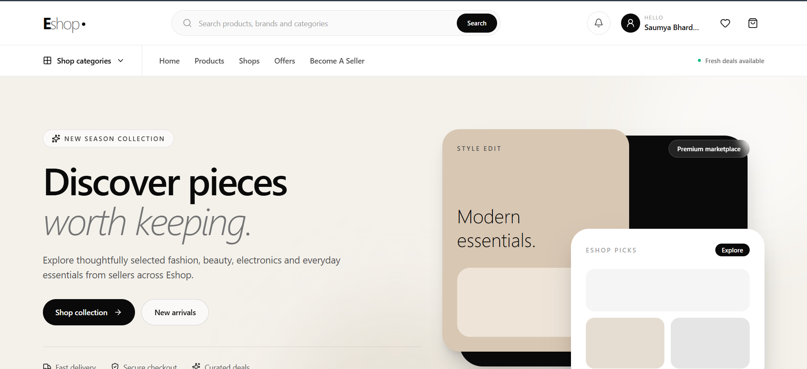
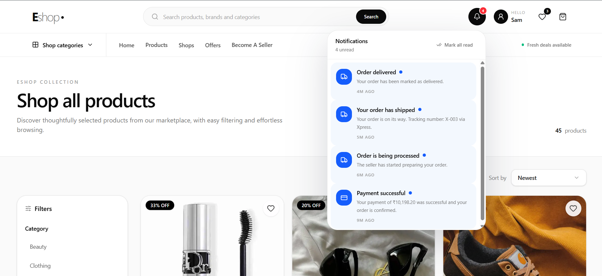
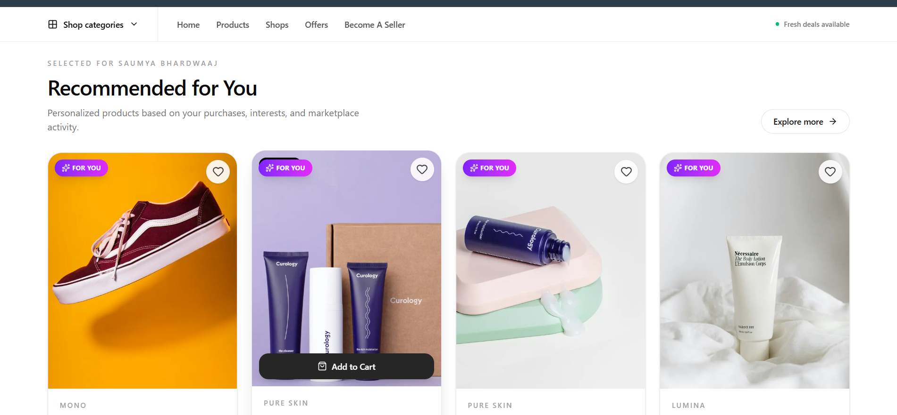
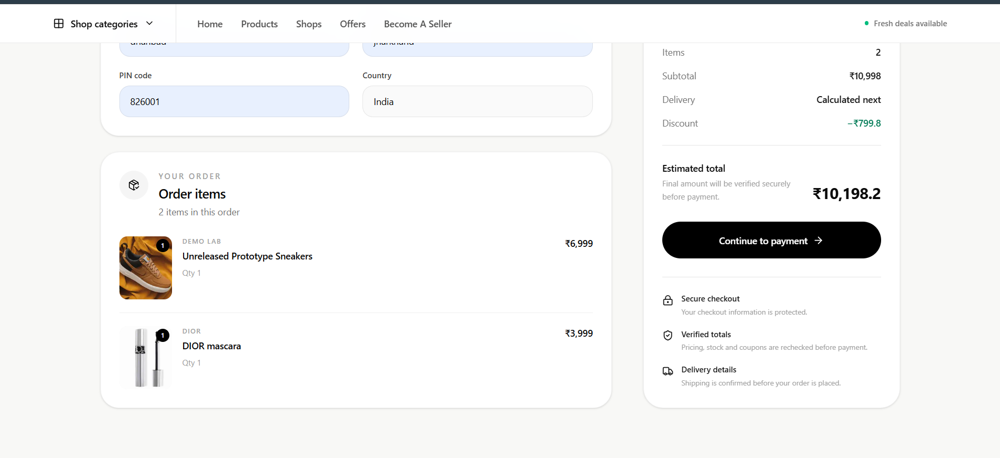
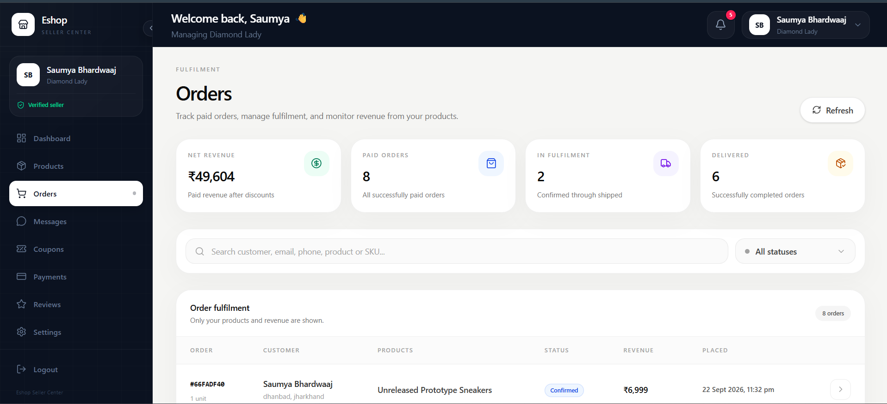
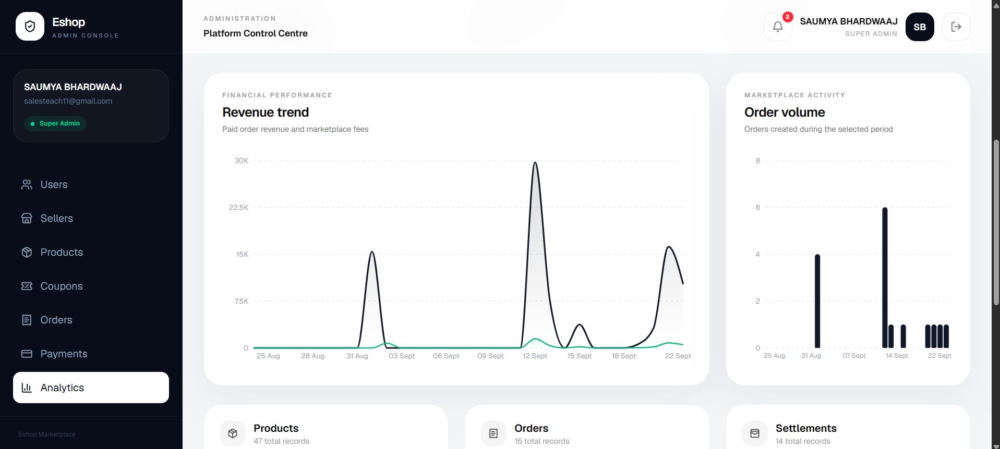

# Eshop — Event-Driven Microservices Commerce Platform

A production-deployed, full-stack e-commerce platform built using an event-driven microservices architecture.

Eshop provides separate customer, seller and administrator applications alongside independent backend services for authentication, products, coupons, orders, payments, notifications, chat, event processing and personalized recommendations.

> The complete production source code is maintained in a private repository. This public repository contains project documentation, architecture information and product demonstrations only.

---

## Project Status

- Production deployment completed
- Customer, seller and administrator flows verified
- Event-driven communication operational
- Kafka producers and consumers connected
- Personalized recommendation engine operational
- Payment and order lifecycle verified
- Production builds completed successfully
- Production dependency audit passed with zero vulnerabilities
- Complete implementation privately maintained

---

## Platform Applications

### Customer Application

The customer-facing storefront provides:

- Secure account registration and authentication
- OTP-based email verification
- Password recovery
- Product search, filtering and sorting
- Category-based product discovery
- Product details and customer reviews
- Cart and wishlist management
- Coupon validation
- Secure checkout
- Razorpay payment integration
- Order history and tracking
- Customer-to-seller chat
- Persistent notifications
- Personalized recommendations
- Similar-product recommendations
- Trending products
- Frequently bought together recommendations

### Seller Application

The seller platform provides:

- Independent seller authentication
- Seller onboarding and shop configuration
- Product creation and management
- Draft and published product states
- Inventory management
- Coupon management
- Order management
- Order-status updates
- Payment and settlement visibility
- Customer messaging
- Seller dashboard and business metrics

### Administrator Application

The administrative platform provides:

- Secure administrator authentication
- Platform-wide dashboard
- Customer and seller management
- Product moderation
- Order supervision
- Payment monitoring
- Coupon administration
- Platform analytics
- Marketplace operational oversight

---

## Recommendation Engine

Eshop includes a dedicated recommendation microservice that consumes marketplace activity through Kafka and produces several recommendation strategies:

- Personalized recommendations based on customer interactions
- Similar products based on category, brand, tags, price and activity
- Trending-product recommendations
- Frequently bought together recommendations
- Anonymous product-view tracking using session identity
- Authenticated product-view tracking using user identity
- Asynchronous interaction processing through Kafka

Recommendation data is updated asynchronously without blocking customer-facing product requests.

---

## System Architecture

The API Gateway acts as the public entry point and routes requests to independently deployable domain services.

Kafka decouples synchronous marketplace operations from asynchronous event processing, notifications and recommendation generation.

---

## Event-Driven Workflow

Examples of processed domain events include:

- Product published
- Product viewed
- Order created
- Order status updated
- Payment completed
- Chat message sent
- Settlement completed

---

## Core Microservices

| Service | Primary responsibility |
|---|---|
| API Gateway | Public routing, CORS, rate limiting and service proxying |
| Authentication Service | Customer, seller and administrator identity management |
| Product Service | Catalogue, inventory, cart, wishlist and reviews |
| Coupon Service | Coupon creation, management and server-side validation |
| Order Service | Order creation, authoritative pricing and order lifecycle |
| Payment Service | Razorpay order creation and payment verification |
| Notification Service | Persistent marketplace notifications |
| Chat Service | Customer and seller conversations |
| Admin Service | Platform administration and analytics |
| Event Service | Kafka event consumption and event processing |
| Recommendation Service | Personalized, similar, trending and frequently bought recommendations |

Each service is independently buildable and deployable while sharing carefully controlled infrastructure packages through the Nx monorepo.

---

## Technology Stack

### Frontend

- Next.js
- React
- TypeScript
- Tailwind CSS
- Axios
- Context API
- React Hook Form
- Lucide Icons

### Backend

- Node.js
- Express.js
- TypeScript
- Nx Monorepo
- Prisma ORM
- MongoDB
- Redis
- JWT authentication
- HTTP-only cookies

### Events and Recommendations

- Apache Kafka
- KafkaJS
- Event-driven service communication
- Product-interaction processing
- Recommendation scoring
- Product and order event consumers

### Payments and Media

- Razorpay
- Cloudinary

### Infrastructure

- Vercel
- Northflank
- Aiven Kafka
- MongoDB Atlas
- Docker
- GitHub
- CI/CD deployment pipelines

---

## Authentication and Authorization

Eshop maintains separate authentication flows for:

- Customers
- Sellers
- Administrators

Authentication features include:

- JWT access tokens
- Refresh-token flow
- HTTP-only cookies
- Role-based authorization
- Account-specific cookie separation
- OTP email verification
- Password reset verification
- Protected service routes
- Automatic token refresh in frontend applications

---

## Security

The platform implements:

- Short-lived JWT access tokens
- Secure refresh-token handling
- HTTP-only authentication cookies
- Role-based access control
- Separate customer, seller and administrator identities
- Server-authoritative pricing
- Server-side coupon validation
- Razorpay signature verification
- Rate limiting
- CORS origin restrictions
- Request validation
- Protected internal service routes
- Environment-based secret management
- Production dependency auditing
- Private production source repository

No credentials, environment variables, private certificates or infrastructure secrets are included in this public repository.

---

## Authoritative Checkout Design

Product prices, discounts, coupon rules and final order totals are recalculated by backend services.

The frontend is never treated as the authoritative source for:

- Product prices
- Discount amounts
- Coupon validity
- Shipping totals
- Final payable amounts
- Payment completion
- Inventory updates

Inventory reduction, cart clearing and coupon usage updates occur only after successful payment verification.

This prevents users from manipulating checkout values through frontend requests.

---

## Recommendation Strategies

### Personalized Recommendations

Customer interactions are consumed asynchronously and used to identify products aligned with the customer’s recent activity.

### Similar Products

Products are compared using signals such as:

- Category
- Brand
- Tags
- Price range
- Marketplace activity

### Trending Products

Product-view and marketplace activity events contribute to product popularity scoring.

### Frequently Bought Together

Completed order data is used to identify products that commonly appear together across purchases.

---

## Payment and Order Flow

After successful payment verification, the backend:

1. Confirms the payment.
2. Updates the order and payment states.
3. Reduces product inventory.
4. Updates coupon usage when applicable.
5. Clears purchased cart items.
6. Publishes payment and order events.
7. Generates notifications.
8. Updates recommendation data asynchronously.

---

## Deployment Architecture

### Vercel

Used for:

- Customer application
- Seller application
- Administrator application
- API Gateway

### Northflank

Used for long-running containerized services including:

- Event consumers
- Recommendation consumers
- Kafka-connected background services

### Managed Infrastructure

- Aiven provides Kafka infrastructure.
- MongoDB Atlas provides persistent application data.
- Redis supports temporary authentication and application state.
- Cloudinary manages product media.
- Razorpay provides payment processing in test mode.

Both Vercel and Northflank retain authorized access to the private production repository for CI/CD deployments.

---

## Production Verification

The completed production smoke test covered:

- Customer registration, login and logout
- Seller authentication and dashboards
- Administrator authentication and dashboards
- Product discovery and product details
- Product search, filters and categories
- Cart and wishlist operations
- Coupon validation
- Checkout and Razorpay test payment
- Order creation and order history
- Inventory updates
- Seller order management
- Administrator marketplace operations
- Notifications and chat
- Trending recommendations
- Personalized recommendations
- Similar products
- Frequently bought together recommendations
- Kafka producer and consumer connectivity
- Service health endpoints
- Vercel production deployment
- Northflank container deployment
- Redeployment after making the source repository private

---

## Screenshots

### Customer Storefront

### Product Details

### Recommendation Engine

### Cart and Checkout

### Seller Dashboard

### Administrator Dashboard

Product screenshots will be added to the `screenshots` directory.

Planned showcase images include:

- Customer storefront
- Product catalogue
- Product details and recommendations
- Cart and checkout
- Customer order history
- Seller dashboard
- Seller product management
- Administrator dashboard
- Kafka event processing
- Deployment health

---

## Source-Code Availability

The complete source code is maintained in a private GitHub repository.

This public showcase intentionally excludes:

- Application source code
- Internal business logic
- Database schema implementation
- Deployment configuration
- Dockerfiles
- Environment variables
- Certificates
- API credentials
- Infrastructure secrets

Private source access may be provided selectively for legitimate recruitment, technical evaluation or collaboration purposes.

---

## Repository Policy

This repository is provided exclusively for:

- Portfolio presentation
- Technical evaluation
- Architecture demonstration
- Recruitment review

The implementation, documentation and assets may not be copied, redistributed, modified, sold, sublicensed or represented as another person’s work without prior written permission.

See [NOTICE.md](./NOTICE.md) for ownership and usage information.

---

## Author

### Saumya Bhardwaaj

Full-Stack Developer and B.Tech Electronics and Communication Engineering student.

- GitHub: [Sam-B-codes](https://github.com/Sam-B-codes)
- Portfolio: [sam-b-codes.vercel.app](https://sam-b-codes.vercel.app/)

---

## Project Purpose

Eshop was designed and developed as a production-oriented demonstration of:

- Full-stack product engineering
- Microservices architecture
- Event-driven systems
- Secure authentication and authorization
- Distributed business workflows
- Payment processing
- Recommendation systems
- Containerized deployment
- Cloud infrastructure
- CI/CD
- Marketplace user experience

---

## Ownership

Copyright © 2026 Saumya Bhardwaaj. All rights reserved.

The complete implementation is proprietary and privately maintained.